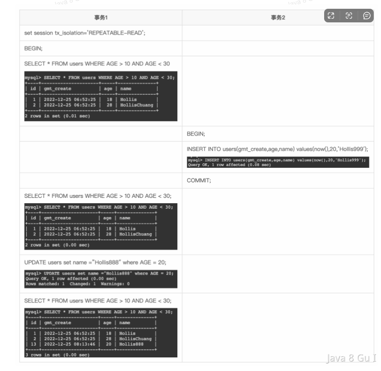

### MySQL（day * 10）
1. 关系型和非关系型数据库 -- 

2. ** join用法
   1. simple nested loop(N*M嵌套循环)； 
   2. index nested loop(N*logM用到索引字段)； 
   3. block nested loop(N*M但把M数据放到内存然后N每行和整个buffer比较)
   
3. ** 一条SQL执行过程
   1. 连接器，通过客户端/服务器通信协议与MySQL建立连接并查询是否有权限
   2. MySQL8.0前检查是否开启缓存
   3. 解析器，语法解析和语义分析并生成解析树。如查询select
   4. 优化器，生成执行计划。如根据索引看看是否需要优化
   5. 执行器，执行SQL语句查询存储引擎

4. Innodb支持哪几种格式
   1. COMPACT：
   2. ...

5. ** 数据库事务（transaction）是访问并发可能操作各种数据项的一个数据库操作序列？？？
   1. 原子性：事物作为一个整体被执行。要么全执行要么都不执行
   2. 一致性：事物确保数据库的状态从一个一致状态转变到另一个一致状态，一致状态含义是数据库中的数据应满足完整性约束（实体完整性如不能为null主键重复、参照完整性如外键..）
   3. 隔离性：多个事物并发执行时，一个事物的执行不影响其他事物的执行
   4. 持久性：一个事物一旦提交，永久保留

6. *** Innodb一次更新事务操作，一次update操作涉及到BufferPool、BinLog、UndoLog、RedoLog以及物理磁盘
   1. BufferPool中读取数据：当Innodb更新一条记录时会先看看在buffer中是否在内存中存在，如果不存在则从磁盘读取该页
   2. 记录UndoLog：记录修改前数据保证数据原子性和一致性，用于事务回滚时恢复到修改前的状态；开始写到内存中后由一个线程刷到磁盘
   3. BufferPool中更新数据：先更新buffer中的数据
   4. 记录RedoLog：在buffer修改操作同时也会降修改操作记录到redo log，用于服务器宕机恢复buffer日志
   5. 提交事务：执行完修改后事务被提交、同时将Redo Log写入磁盘保证事务持久性、并将buffer的数据页标记为脏数据
   6. 写入磁盘：提交后会将buffer的脏数据写入磁盘？
   7. 记录Binlog：提交过程会将事务提交信息记录到binlog，实现主从复制主要包括内容事务开始时间、结束时间、事务id等
   8. 「注意」binlog和redo log写入过程分成两阶段提交，保证一致性

7. **** 脏读、幻读、不可重复读 及 解决方案
   1. 脏读：读到了还没提交的事务 -- MVCC通过限制了只能读比其小的即已提交的事务
   2. 不可重复读：数据读取过程中有其他事务进行了修改UPDATE，导致两次读的结果不同 -- MVCC在RR级别下只在第一次读取时候生成read view (RC则是每次读取都生成)
   3. 幻读：事务在范围查询过程中有其他事务对范围内新增或者删除，导致两次读的条数不同
      1. RR+快照读：MVCC可以保证每次读的都是第一次快照也就不会有幻读问题（select..）
      2. RR+当前读：MVCC会通过当前读的间隙锁保证无法插入也不会有幻读问题（select ... for update）
      3. RR+（快照读+当前读）：混合情况会导致第一次的快照数据失效从而可见到读取件看到的数据  见：
   
8. 为什么MySQL默认使用RR隔离级别
   1. Oracle只有RC、Serialization、Read-only；
   2. MySQL的RR之间主要为了解决在「RC + binlog的statement」(老的版本)格式下的主从同步时，从库执行事务顺序不一致而引起的数据不一致问题（而RR级别下有GAP锁会限制事务2执行卡住）
   
9. *** RR vs RC
   1. 一致性读：RR第一次就生成且在更改的时候更新；RC每次都会生成
   2. 锁机制：RR会支持Record Lock、Gap Lock、Next-Key Lock； 而RC只有行锁
   3. 主从同步：RC只支持row格式的binlog； RR支持statement、row和mixed三种
   
10. *** MVCC
    1. UndoLog：是实现MVCC重要手段？？？
    2. 行记录的隐式字段：db_row_id、db_trx_id、db_roll_ptr
    3. Read View: 用于判断一个事务应该看到哪些快照不应该看到哪些快照，trx_ids、low_limit_id、up_limit_id、creator_trx_id
    
11. InnoDB的行锁与表锁
    1. 这点MySQL与Oracle不同，前者是通过给索引上的索引项加锁来实现，后者是通过在数据块中对相应数据行加锁实现
    2. 所以只有通过索引条件检索数据InnoDB才使用行级锁，否则将使用表锁
    
12. 加锁原子与优化
    1. 原则1：加锁的基本单位是next-key lock，是一个前开后闭区间
    2. 原则2：查找过程中访问到的对象才会加锁
    3. 优化1：索引上的等值查询，给唯一索引加锁的时候，next-key lock退化为行锁
    4. 优化2：索引上的等值查询，向右遍历时且最后一个值不满足等值条件的时候，next-key lock退化为间隙锁
    
13. 乐观锁与悲观锁
    1. 悲观锁：select...for update方式加锁，再update修改
    2. 乐观锁：一般是通过version实现
    
14. B+树索引
    1. 支持范围查询：数据都在叶子节点而且节点之间有指针链接，可以很方便
    2. 支持排序：B+树叶子节点按照顺序存储
    3. 存储更多的索引数据：非叶子节点只存储索引关键字
    4. 节点分裂和合并时IO操作少：B+树叶子节点大小固定且一般会设置为一页带到，这就使得分裂和合并时候只需要读入和写入一页
    5. 有利于磁盘预读：由于B+树大小固定因此可以利用磁盘预读特性一次性读取多个节点到内存
    
15. InnoDB不用红黑树或B树？
    1. 红黑树：范围查询、有利于磁盘预读、优化排序
    2. B树：更矮更多的数据存储

16. 唯一索引
    1. 查询更快：能够更快速定位到唯一的记录
    2. 缺点：插入数据时要检查是否存在相同的索引值

17. 聚蔟索引和非聚簇索引
    1. 聚簇：非叶子节点上存储的是索引值，而叶子节点上存储的是整行记录
    2. 非聚簇：非叶子节点上存储的是索引值，而叶子节点上存储的是主键的值

18. 回表：当我们根据非聚蔟索引查询的时候会先通过非聚蔟索引查询到主键的值，之后再通过主键查询一次才能得到我们想要的数据。这个过程就是回表
    1. 覆盖索引
    2. 索引下推：其实是解决索引失效带来的效率低下的一种手段

19. 索引设计原则
    1. 考虑查询的频率和效率
    2. 选择适合的索引类型
    3. 考虑区分度
    4. 考虑联合索引
    5. 考虑覆盖索引

20. 自增主键，一般都创建自增的好处是
    1. 索引大小更小
    2. 索引顺序和插入顺序相同
    3. 安全性：利用自增避免主键重复的情况
    4. 较少分裂

21. order by
    1. 走索引：select * .. order by a limit 10; select a,b .. order by a limit 10; select a,b,c .. order by a;
    2. 走filesort：全字段排序（先查询再排序）、row_id排序（先排序再回表）

22. count
    1. count(*)/count(1)
    2. count(a)：要判断字段是否为null，慢一些

23. limit：limit n,m的原理是先读取前面m+n条数据然后抛弃前m条然后返回n条，所以m越大偏移量越大性能就越差
    1. 深翻页：换成ES
    2. 主键索引：先通过子查询查出最下的id再根据id查询减少回表 select..from where id > (select id from limit 1000,1)
    3. 延迟链接：减少回表次数 select..from inner join (select id from limit 1000,1) using(id)

24. redo、undo、binlog
    1. redo：是re+do再做一次的意思，用于实现奔溃恢复和数据持久化的一种机制..
    2. undo：回退的意思，用于事物回滚或系统奔溃时撤销（回滚）事务所做的修改；另外还支持MVCC机制用于并发事务执行时提供一定的隔离性
    3. binlog：二进制，原始的意思。用于对数据库进行数据备份、灾难恢复和数据复制

25. 如何优化一个大规模的数据存储系统
    1. 硬件优化：内存、磁盘、CPU和网络宽带
    2. 数据库设计：分表分库
    3. 查询优化：索引
    4. 索引优化
    5. 缓存机制
    6. 负载均衡
    7. 数据备份和恢复
    8. 性能监控和调优

26. 死锁发生原因
    1. 资源竞争：多个事务竞争同时访问相同的资源
    2. 未释放资源：事务再使用完后未及时释放资源
    3. 不同事务的执行速度

27. 避免死锁方法
    1. 减少锁的数量：比如RC来代替RR减少gap和next-key锁带来的死锁
    2. 减少锁的时间：加快执行速度
    3. 减少操作的数据量

