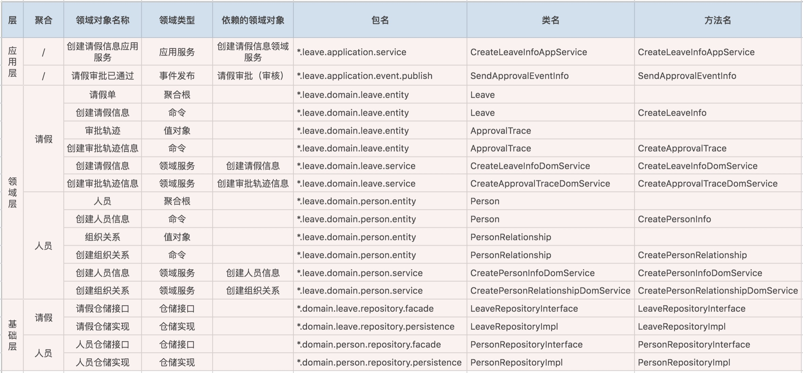

### DDD的战略设计&战术设计
> 1. 战略设计从业务视角出发。建立业务领域模型，划分领域边界，建立通用语言的限界上下文。（限界上下文可以作为微服务设计边界参考）
> 2. 战术设计侧重于技术实现。聚合根，实体，值对象，领域服务等

#### 领域 子域 核心域 通用域和支撑域
> 1. 领域：DDD将问题范围限定在边界内，领域就是边界内要解决的问题
> 2. 子域：领域进一步划分为子域
> 2.1 核心域
> 2.2 支撑域
> 2.3 通用域：认证，权限等
> 附：细胞是最小单元。细胞就可以理解为DDD的聚合，细胞内的物质就是聚合里的聚合根，实体及值对象

#### 限界上下文
> 通用语言，使得领域专家和开发人员能够协同合作。
> 建立领域对象和代码对象的一一映射
> 限界上下文就可以定义，模型适用范围是所有成员明确在统一的领域边界内用统一的语言交流

---

#### 建立聚合模型
1. 减少贫血模型(实体中只有get与set方法)
2. 不要把领域模型的业务逻辑放到上层应用服务中
3. 也不要将业务逻辑委托给帮助/工具类
4. 这些都会让业务逻辑与模型分离。 

#### 设计领域模型的一般步骤如下
1. 根据需求划分出初步的领域和限界上下文，以及上下文之间的关系 (领域的边界在哪？ )
2. 进一步分析每个上下文内部，识别出哪些是实体，哪些是值对象
3. 对实体、值对象进行关联和聚合，划分出聚合的范畴和聚合根
4. 为聚合根设计仓储，并思考实体或值对象的创建方式
5. 在工程中实践领域模型，并在实践中检验模型的合理性，倒推模型中不足的地方并重构

