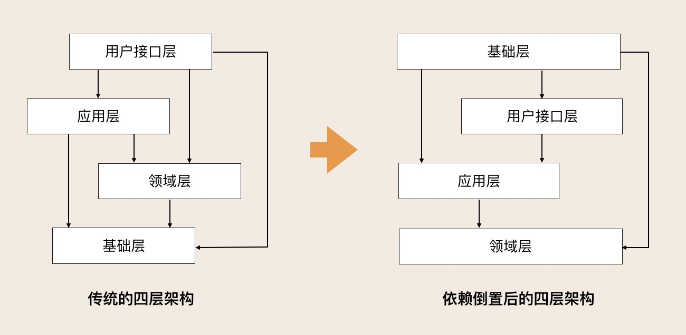

### 不思考 = 没看过

#### DDD的战略设计&战术设计
> 1. 战略设计从业务视角出发。建立业务领域模型，划分领域边界，建立通用语言的限界上下文。（限界上下文可以作为微服务设计边界参考）
> 2. 战术设计侧重于技术实现。聚合根，实体，值对象，领域服务等

#### 领域 子域 核心域 通用域和支撑域
> 1. 领域：DDD将问题范围限定在边界内，领域就是边界内要解决的问题
> 2. 子域：领域进一步划分为子域
> 2.1 核心域
> 2.2 支撑域
> 2.3 通用域：认证，权限等
> 附：细胞是最小单元。细胞就可以理解为DDD的聚合，细胞内的物质就是聚合里的聚合根，实体及值对象

#### 限界上下文 Bounded Context
> 通用语言，使得领域专家和开发人员能够协同合作。
> 建立领域对象和代码对象的一一映射
> 限界上下文就可以定义，模型适用范围是所有成员明确在统一的领域边界内用统一的语言交流

#### 实体 Entity
> 1. 拥有唯一标识符。
> 2. 在DDD里这些实体通常采用充血模型，与实体相关的所有业务逻辑都在实体类的方法中实现，跨多个实体领域逻辑则在领域服务中实现
> 3. 与传统数据模型设计不用的是，DDD先构建领域模型及实体对象和行为，再将实体映射到持久化对象。这可能一对一也会一对多

#### 值对象 ValueObject
> 

#### 聚合 Aggregate
> 领域模型内的实体和值对象就好比个体，而能让实体和值对象协同工作的组织就是聚合。确保这些领域对象在实现共同业务逻辑时能保证数据的一致性

#### 聚合根 Aggregate Root
> 1. 把聚合比喻组织，那聚合根就是这个组织的负责人。它不仅是实体还是聚合的管理者
> 2. 聚合之间通过聚合根ID关联引用，如果要访问其他聚合的实体就要先访问聚合根在导航到聚合内部实体，外部对象不能直接访问聚合根内部实体
> 3. juhe

**_聚合的诞生_**
1. 根据业务行为，梳理所有的实体和值对象
2. 在众多实体找到适合作为管理者的聚合根
3. 业务单一职责&高内聚原则 找出与聚合根密切依赖的实体及值对象
4. 聚合根-实体-值对象之间的依赖关系

#### 领域事件
> 1. 领域事件驱动设计可以切断领域模型之间的强依赖，发布方不必关心后续订阅方事件处理是否成功 
> 2.  

**微服务内的领域事件**
> 为服务内应用服务可以通过跨聚合的服务编排和组合，以服务调用的方式完成跨聚合的访问

**微服务间的领域事件**

#### DDD分层架构

改变的核心就是 架构的核心不应该是之前的基础层而应该是后面的领域层

但是依赖倒置是怎么解决这个问题的?
> 依赖倒置举个例子，领域层是通过仓储接口获取基础资源的数据对象，仓储接口会调用仓储实现，
具体的基础资源的数据处理过程是在仓储实现中完成的。这样做的好处是，避免将仓储实现的代码混入上层业务逻辑中。
如果以后替换数据库，由于做了基础资源的个性的代码隔离，所以实现了应用逻辑与基础资源的解耦。
在更换数据库时只需要更换仓储相关的代码就可以了，应用的逻辑不会受太大的影响

> 1. 用户接口层
> 2. 应用层，很薄的一层可以作为微服务之间交互的通道
> 3. 领域层，聚合根实体领域服务等其中领域服务聚合多个实体实现复杂逻辑
> 4. 基础层，
> 每层只能与其下方的发生耦合

#### Tips
> 1. 领域层是核心 应用层通过服务组合和编排来实现业务流程的快速适配上线较少传到领域层的需求是其保持长期稳定
> 2. 中台要聚焦领域模型

