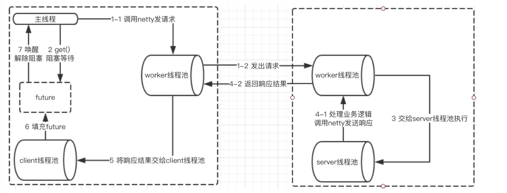

<!--Dubbo 学习总结-->

#### 1.Service 参数
|  属性   |    缺省  |  作用    |    实现    |   关键源码    |
|------   | -----------  |  -------  | ---------  |---------  |
| group    |         |  同一组内的提供服务   | zk创建povider_url后 比较isMatch provier和consumer的符号 empty | ZookeeperRegistry#toUrlsWithEmpty(consumer, path, providers)|
| timeout  |  1000   |  rpc 连接超时控制    | 1.get()同步  2.TimeoutCheckTask轮训       |     TimeoutCheckTask#DefaultFuture.received(future.getChannel(), timeoutResponse);      |
| connectTimeout  |  5000   |  Netty 初始化连接    |   Netty细节   |     bootstrap.setOption("connectTimeoutMillis", getConnectTimeout())    |
| connections  |   1    |   创建几个 client做invoke时候使用    |      |  DubboProtocol#getClients()       |
| generic |        |        |         |         |
| url     |        | 点对点直连服务提供者地址，将绕过注册中心      |         |         |
| stub    |  false |        | StubProxyFactoryWrapper 是proxyFactory的aop wrapper    |         |
| mock    |        |        |         |         |
| token   |string/boolean  | 令牌的作用是防止消费者绕过注册中心直接访问 保证注册中心的授权功能有效，如果使用点对点调用，需关闭令牌功能  |  PROVIDER下TokenFilter验证     |         |
| cache   |        |  以调用参数为key，缓存返回结果，可选：lru, threadlocal, jcache等     |    CacheFilter缓存<url, new ValueWrapper(result.getValue()>   |         |
| validation  |        |        |         |         |
| actives   | Integer.MAX_VALUE  |  每服务消费者每服务每方法最大并发调用数        |     ActiveLimitFilter    |         |
| executes  | Integer.MAX_VALUE  |  服务提供者每服务每方法最大可并行执行请求数    |         |         |
| filter    |        | service.filter 服务提供方远程调用过程拦截器名称，多个名称用逗号分隔      |         |         |
| listener  |        | exporter.listener 服务提供方导出服务监听器名称，多个名称用逗号分隔      |         |         |
| layer  |        |  服务提供者所在的分层。如：biz、dao、intl:web、china:acton。      |         |         |
| init   |        |        |         |         |

#### 2.本地存根Stub & 本地伪装Mock
1. 本地存根Stub, 类似于aop的around advice
> 1. 服务方发起调用
> 2. 如果存在本地存根Stub的话会先执行本地存根
> 3. Stub在执行的时候会先执行自己的逻辑before然后proxy远程代理调用再返回after-returning
> 4. 如果Proxy调用过程异常了会执行消费端的Mock，容错数据达到降级

`StubProxyFactoryWrapper` 是个wrapper对象会在 `proxyFactory` 调用之前aop执行。  
代码的主要逻辑是 拿到远程的调用 `DubboInvoker` 作为构造的入参

2. 本地伪装Mock
在 `MockClusterInvoker` 执行失败下 返回的是客户端提供的本地伪装的实现。

通过约定大于配置的理念简化配置

#### 3.本地调用
> 1. Dubbo默认在本地以injvm的方式暴露服务，这样的话在同一个进程里对这个服务的调用会优先走本地调用
> 2. 本地调用默认开启。但是泛化及指定url直联的情况无法使用

#### 4.优雅停机
> 优雅停机默认开启
> 1. 向JVM注册 DubboShutDownHook。每个ShutdownHook都是一个单独的线程由JVM退出时触发执行
> 2. 关闭所有注册中心。注销已经发布的服务；取消当前依赖的服务；断开域注册中心的连接
> 3. protocol 的 destroy()。销毁Invoker和Exporter; 关闭Server，向所有已连接的client发送readonly; 关闭client断开连接；释放资源

#### 5.全日志追踪
Dubbo上下文信息
 > 1. 本端传递。
 > 2. 对端传递。`RpcInvocation#setAttachment`。扩展filter通过隐式传参从provider传递到consumer达到全链路共享同一个traceid

#### 6.异步接口实现

#### 7.Dubbo使用REST
使用
1. 定义在接口上

#### 8.Dubbo心跳方案 & RocketMQ
> 1. 客户端如何得知服务端失败。客户端超时 HashedWheelTimer
> 2. 心跳检测需要容错。ReconnectTimerTask
> 3. 心跳检测不需要忙检测。心跳扮演的角色应当是晴天收伞雨天送伞。维护 `lastRead & lastWrite` 字段并在每次消息sent更新channel的字段
> 4. 定时不精确，即第1s已经断开但是60s才发现。定为20

#### 9.HashedWheelTimer

#### 10.Netty#IdleStateHandler

#### 11.Dubbo注册中心

#### 12.扩展点加载
被缓存的Class和实例对象可以根据不同特性分为不同的类别
> 1. 普通扩展类。
> 2. 包装扩展类。Wrapper类，通用逻辑抽象且需要在构造方法中传入一个具体的实现
> 3. 自适应扩展类。通过URL某些参数动态确定 @Adaptive

#### 13.Dubbo线程模型
IO模型
> 阻塞IO
> 非阻塞IO
> IO复用

