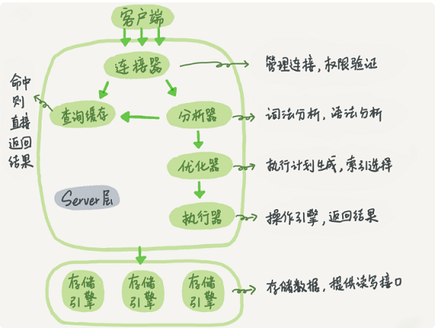
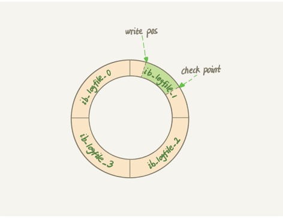
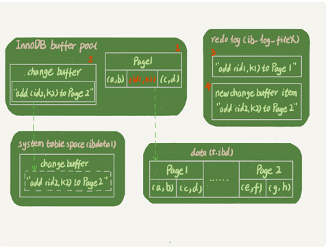
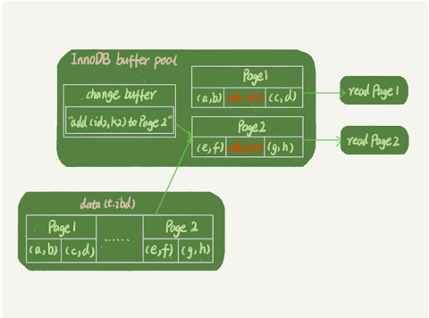

### 1. Server

#### MySQL架构


##### 连接器
1. 管理连接权限验证
2. wait_timeout控制连接时长。
> `show global variables like "%timeout%"` 取得wait_timeout。`set global wait_timeout=10` 重新设置设置

3. 长连接
全部使用长连接之后MySQL内存占用就会涨的很快，最后可能导致被系统强行OOM导致重启。解决方案
> 1. 定期断开。操作占用内存的大查询后断开连接，之后要查询再重连
> 2. MySQL5.7 可以在每次大操作之后通过执行`mysql_reset_connection`来重新初始化连接资源???

4. 连接数maxActive & 等待时间maxWait

##### 查询缓存
> 查询缓存的失效时间非常频繁，只要对一个表有更新这个表上所有的查询缓存都会清空。8.0之后的版本已经废弃

##### 分析器
> 词法分析语法分析

##### 优化器
> 执行计划生成，索引选择

##### 执行器
操作引擎，返回结果
> 进行权限验证
> 调用InnoDB引擎接口取这个表第一行，判断，将着行存放在结果集
> 继续取下一行并重复
> 将结果集返回给客户端

#### redo log和binlog
> WAL技术，Write-Ahead Logging 它的关键点就是先写日志再写磁盘。
> crash-safe, 数据写在redo日志中，当write pos追上checkpoint就停止更新同步一些记录到磁盘
**redo log**
大小固定，位于引擎层
write pos 是当前记录的位置一边写一遍后移，写到第3号文件末尾后就回到0号文件
checkpoint 是当前要擦除的位置，擦除前要把记录更新到数据文件
> 1. Sharp Checkpoint 发生在数据库关闭时将所有的脏页会刷
> 2. Fuzzy Checkpoint 只刷一部分
> 3. Mater Thread Checkpoint 以每秒或10秒的速度从缓冲池的脏页列表刷新
> 4. FLUSH_LRU_LIST Checkpoint  保证有一定数量的数据页
> 5. Async/Sync Flush  重做日志文件不可用
> 6. Dirty Page too much


下列情况会将redo log刷新到磁盘
> 1. Master Thread每秒会将重写日志刷新到重做日志
> 2. 每个事务提交时
> 3. 当重做日志缓存池剩余空间小于1/2




**binlog**
位于Server层的归档日志
> 1. redo log是InnoDB特有的；binlog是MySQL的Server层实现所有引擎使用
> 2. redo log记录的物理日志，即在物理机层面的比如'磁盘前后在某个数据上做了什么修改';
> 3. binlog是逻辑日志记录的是原始逻辑比如statement-'原始语句'；row-'前后变化行'；mixed-''
> 4. redo 是循环写空间固定；binlog是不断追加

#### mysql抖动
> 内存不足 / redo日志满了 --> flush刷脏，造成短暂不可用


### 存储引擎

#### 后台线程
1. Mater Thread
> 主要负责将缓冲池中的数据异步刷新到磁盘保证数据的一致性，包括脏页的刷新，合并入缓冲(insert buffer)
> UNDO页回收等

2. IO Thread


3. Purge Thread

> 1. 负责刷新内存池数据，保证缓存池中的内存缓存是最近的数据（什么时候刷新？）
> 2. 将已经修改的数据文件刷新到磁盘（change buffer不是读的时候刷新？）
> 3. 保证数据异常的情况Innodb能回复


#### 内存池
> 1. 维护所有进程/线程需要访问的多个内部数据结构
> 2. 缓存磁盘数据，同时对磁盘文件数据修改之前在这里缓存
> 3. redo log缓存

**缓冲池**
> show variables like 'innodb_buffer_pool_size';


### 2. MySQL执行流程

#### update
SQL简单的更新流程
> 1. 执行器找到引擎取ID = 2这行。查看是否在内存？否则从磁盘读入内存
> 2. 执行器拿到结果 加1，再更新
> 3. 引擎将数据先更新内存，再写redo。此时redo处于prepare状态
> 4. 执行器将生成这个操作的binlog并把binlog写入磁盘
> 5. 提交事务，引擎把redo改成commit（两阶段提交）

***两阶段提交 主要就是防止在对数据恢复到任意一秒状态操作时不会造成数据的不一致性***


#### insert...select
`insert into t2(c,d) select c,d from t;`
> 在RR级别下，binlog_format=statement 时执行会产生间隙锁(-,1]。
> 主要是为了防止插过程中有其他的插入行为，导致最终写binlog备份时产生不一致


#### 表数据删除
delete只是把记录的位置或数据页标记为了"可复用"但是磁盘文件的大小是不会变的
因为B+索引分裂 可能造成的page空洞
重建表，把A的数据重建到B中较少空洞。在mysql5.6 online DDL
alter table t where engine=InnoDB

#### 读一行也慢
1.锁等待  show processlist;
2.等flush
3.等行锁

#### count(*)
MyISAM引擎把表的总行数存在磁盘上了因此执行count(*)的时候效率很高
同一时刻查询 由于多版本并发控制(MVCC)的原因 InnoDB表"应该返回多少"也是不确定的 --> 自己计数
count(*)~~
count(1) -- 每一行不为null 则放个数字"1" >
count(id) -- 拿到每一行的id返回给server  >
count(字段) --

#### order by
sort_buffer
select id from t order by rand() limit 3;

#### group by

`select id%10 as m, count(*) as c from t1 group by m;`

> 1. 创建内存临时表，表里有两个字段m和c，主键是m; Using Temporary
> 2. 扫描表t1的索引a，依次取出叶子节点上的id值计算id%10的结果记为x;如果没有就插入否则加1
> 3. 遍历完成在根据m做排序返回给客户端
> 4. 附：如果不想在分组的时候排序 可以order by null

**优化1--索引**
利用索引满足输入有序的条件，可以单独起个索引列
` select z, count(*) as c from t1 group by z; `

**优化2**
当group by数据量很大不走临时表直接走磁盘
 ` select SQL_BIG_RESULT id%100 as m, count(*) as c from t1 group by m; `


#### left join
> left join
> straight_join

**1. Index Nested-Loop Join (NLJ)**

`select * from t1 straight_join t2 on (t1.a=t2.a);`
> 1. 从表t1中读取一行数据R
> 2. 从数据行R中取出a字段到表t2里去查找
> 3. 取出t2中满足条件的行跟R组成一行作为结果集的一部分
> 4. 重复以上步骤
> 5. 时间复杂度：N + N*2*lgM (N是驱动表；M是被驱动表)。故应该小表作为驱动表


**2. Simple Nested-Loop Join**

`select * from t1 straight_join t2 on (t1.a=t2.b);`
> 1. 取出驱动表每一行数据到被驱动表做全表匹配，匹配成功的返回
> 2. 在没有索引的情况下共扫描100 * 1000行

***与BNL比较就是没有在Buffer Pool就需要等待数据从磁盘读入内存，影响Buffer Pool的命中率；
即使都在内存它每次查找下一个记录就是类似指针而join buffer是数组遍历成本低***


**3. Block Nested-Loop Join(BNL)**

> 1. 把表t1数据读入join_buffer
> 2. 扫描t2 把t2中每一行取出来跟join_buffer对比，如果join_buffer大小不够则分多次进行
> 3. 时间复杂度：

*在决定哪个表作驱动表的时候应该是两个表按照各自的条件过滤之后，
计算各个字段的总数量，数据量小的那个就是小表应该作为驱动表。*


**4. join 中`on` 和 `where` 的使用**
```sql
select * from a left join b on(a.f1=b.f1) and (a.f2=b.f2); /*Q1，b无索引*/
select * from a left join b on(a.f1=b.f1) where (a.f2=b.f2);/*Q2*/
```
> Q1会把 NULL 值也作为一行查出来
> Q2则在查找 where a.f2=b.f2中就不会包含NULL。此时它的语义和join一样??? 优化器直接优化成join从而把a作为了被驱动表

```sql
select * from a join b on(a.f1=b.f1) and (a.f2=b.f2); /*Q3*/
select * from a join b on(a.f1=b.f1) where (a.f2=b.f2);/*Q4*/
```
改写成
`select * from a join b where (a.f1=b.f1) and (a.f2=b.f2);`

***如果需要left join语义就不能把被驱动表放在where条件里做等值或不等判断***


#### 内部临时表
```sql
     create temporary table temp_t like t1;
     alter table temp_t add index(b);
     insert into temp_t select * from t2 where b>=1 and b<=2000;
     select * from t1 join temp_t on (t1.b=temp_t.b);
```
> 内存表：指的是由Memory引擎创建的表 语法结构为 create table ... engine = memory
> 临时表：每个引擎都能创建 语法结构 create temporary table...

**临时表特点**
1. 只能由被他创建的session看见，对其他线程不可见
2. 临时表可以和其他库表同名 `table_def_key`:`'库名+表名'+ session_id + thread_id`
3. session A内既有临时表和普通表的时候，show create语句以及其他的增删改查都只是临时表
4. show tables不显示临时表
5. 对于"MySQL异常重启，应用程序异常断开"这样的情况临时表会自动回收，但是如果线程池保持长链接就会由问题 所以最好还是用完删除

**用处**
1. 分库处理
> 1. 在汇总库上创建一个临时表temp_ht, 表中包含需查询的字段
> 2. 在各个分库上执行查询
> 3. 汇总到temp_ht
> 4. 到临时表中查询

主备同步时临时表处理
1. binlog_format= row


#### union


#### 自增主键
不同的引擎对于自增值保存策略不同
> 1. MyISAM引擎保存在数据文件中
> 2. InnoDB 5.7之前保存在内存中重启依靠max(id)+1恢复；8.0版本记录在redo log中

**自增算法** 从auto_increment_offset开始以auto_increment_increment为步长持续叠加。默认值都是1
自增主键不连续原因
1. 在先获取当前自增值后，插入过程因为唯一索引等原因失败
2. 回滚。为了保证数据的一致性及系统并发粒度不对主键进行回滚了
3. 批量插入的会增大式分配但是用不完的话就会导致浪费

自增锁的优化innodb_autoinc_lock_mode
> 1. 设置0时，语句执行结束后释放
> 2. 设置1时：普通insert语句自增锁申请之后马上释放；insert...select批量插入数据的等语句结束后释放
> 3. 设置2时，所有申请自增主键申请后就释放

**批量插入解析insert...select=1原因**
insert...select=1 为了防止在session1执行过程中session2在binlog中间插入导致备库时不一致
**解法**
1. 批量插入数据语句固定生成连续id
2. innodb_autoinc_lock_mode=2 & binlog_format=row


---

### 3. MySQL索引结构

#### 索引

**常见索引模型**
1. 键-值：利用哈希函数把Value放到Key换算成确定的数组位置。只适用于等值查询，范围查询就需要全部扫描一遍
2. 有序数组：同时满足等值和范围查询。不适用与更新等操作
3. 二叉搜索树：每个节点的左儿子小于父节点，父节点小于右儿子。

#### 树
1. 二叉查找树: 磁盘I/O  1.每个节点存储多个元素 2.采用N叉树
2. 平衡二叉树
3. m阶B树: 数据都保存在节点里如果某个字段太长容纳的数据量受到限制
    1. 根节点至少有两个子节点
    2. 每个中间节点都包含k-1个元素和k个孩子其中 m/2<= k <=m
    3. 每个叶子节点都包含k-1个元素
    4. 所有叶子节点都位于同一层
    5. 每个节点中的元素从小到大排序 节点当中k-1个元素正好是k个节点包含的元素的值域分划
4. B+树
    1. 有k个子树的中间节点包含有k个元素（B树中是k-1个元素），每个元素不保存数据只用来索引所有数据都保存在叶子节点
    2. 所有的叶子结点中包含了全部元素的信息，及指向含这些元素记录的指针且叶子结点本身依关键字的大小自小而大顺序链接
    3. 所有的中间节点元素都同时存在于子节点，在子节点元素中是最大（或最小）元素

#### InooDB的索引模型

> InnoDB的索引模型：B+树。每个索引在InnoDB中都对应一颗B+树
> 主键索引：叶子节点存的是整行数据。也被称为聚簇索引
> 非主键索引：叶子节点内容是主键的值。也被称为二级索引
> 采用N叉树的原因：相比于搜索二叉树访问磁盘的次数更少了。1200的数据块树高为4的时候已经有1200的三次方17亿的数据一次访问只要三次访问磁盘

**最左前缀原则**
> 满足最左前缀就可以利用索引来加速检索，这个最左前缀可以是联合索引的最左N个字段也可以是字符串索引的最左M个字符

**索引下推**
> 可以在索引遍历过程中对索引中包含的字段优先锁判断直接过滤不满足条件的记录，减少回表次数

**普通索引和唯一索引**
*查询性能差异：普通索引找到第一个满足的之后需要继续查找下一个，而唯一索引则需要确定唯一性*
*更新性能差异：普通索引利用change buffer减少直接更新并将数据从磁盘读入内存及涉及随机IO访问*
在将普通索引改成唯一索引时在大量更新请求下直接更新磁盘导致库内存命中率下降???

***`change buffer`: 数据更新的时候如果在内存的时候直接更新数据页(掌柜的粉板redo log),如果不在则在不影响数据一致性下
缓存到change buffer中，下次查询访问数据页的时候将数据页读入内存(粉板满了写磁盘)。***
change buffer特性
> change buffer也是可持久化的。在内存中有拷贝也会写入磁盘
> 访问数据页会触发 merge，后台线程及数据库正常关闭也会
> 唯一索引需要判断磁盘是否还有相同数据 所以不能使用change buffer
> 通过innodb_change_buffer_max_size=50表最多只能占用buffer pool的50%

merge过程
1. 从磁盘读入数据到内存
2. 从change buffer找到这个数据页的可能是多个change buffer记录，一次应用
3. 写redo log
对于写多读少的情况merge效果会好相反如果刚刚更新数据放入merge就立即触发merge反而加大了维护change buffer.

**redo log & change buffer**
redo log主要节省的是随机写的IO磁盘消耗(转成顺序写)
change buffer主要节省的则是随机读的磁盘消耗，直接由内存数据页更新

mysql> insert into t(id,k) values(id1,k1),(id2,k2);


1. Page1在内存页 直接更新
2. Page2不在则在change buffer记录下 '我要往Page2插入一行'
3. 将两个动作记入redo log


1. Page1直接内存返回。
2. Page2需要从磁盘读入内存，然后应用change buffer里面的操作日志生成一个正确的版本返回结果。
3. 所以需要读Page2的时候数据页才会被读入内存


---

### 4. MySQL的事务和锁
共享锁(S锁) select ... lock in share mode:
排它锁(X锁) select ... for update:
记录锁：与本身，next-key冲突
间隙锁Gap: 开区间 只与gapII冲突
next-key lock = 间隙锁 + 行锁: 前开后闭
insert_intension lock(gapII): 插入意向锁，只在insert   和Gap或next-key lock冲突
乐观锁：
悲观锁：

MVCC(Multi-Version Concurrency Control)多版本并发控制：获得高并发性能
   “读不加锁，读写不冲突”，对立的就是锁的并发控制不区别当前读和快照读均为当前读即读加读锁写加X锁(Serializable)
在MVCC并发控制中读操作可以分为两类：快照读与当前读
快照读，读取的是记录的可见版本 (有可能是历史版本)，不用加锁
    如select * where
当前读，读取的是记录的最新版本，并且当前读返回的记录都会加上锁，保证其他事务不会再并发修改这条记录
    如lock in share mode(S锁); for update; insert; update; delete

for update 仅适用于InnoDB存储引擎，且必须在事务区块(BEGIN/COMMIT)中才能生效。
select @@tx_isolation;
select * from information_schema.innodb_locks;  -- 查看锁竞争

-- sync_binlog(binlog): 这个参数是对于MySQL系统来说是至关重要的，他不仅影响到Binlog对MySQL所带来的性能损耗，而且还影响到MySQL中数据的完整性
sync_binlog=0, 当事务提交之后，MySQL不做fsync之类的磁盘同步指令刷新binlog_cache中的信息到磁盘，而让Filesystem自行决定什么时候来做同步，或者cache满了之后才同步到磁盘
sync_binlog=n, 当每进行n次事务提交之后，MySQL将进行一次fsync之类的磁盘同步指令来将binlog_cache中的数据强制写入磁盘
当设置为1的时候是最安全但是性能损耗最大的设置因为即使系统Crash，也最多丢失binlog_cache中未完成的一个事务，对实际数据没有任何实质性影响

-- innodb_flush_log_at_trx_commit(redo):
==0, 每次事务提交都只是停留在redo log buffer
==1, 都将redo直接持久化到磁盘
==2, 都只是把redo log写到page cache
InnoDB 有一个后台线程，每隔 1 秒，就会把 redo log中的日志调用write写到文件系统的page cache然后fsync持久化到磁盘

"双1方案"
#### 事务隔离性
事务的ACID: 原子性一致性隔离性持久性
读未提交：可以读取到其他事务未提交的内容，可能导致脏读(读到未提交的数据)
读提交：只能读取到其他事务提交的内容，可能导致不可重复读(两次查询之间有了一次更新)。一般数据库的默认方式但非mysql
可重复读：同一个事务在多实例并发读取数据时可以看到同样的数据，可能导致幻读
串型化：强制事务排序，使之不能相互冲突解决幻读
长事务：set autocommit=1

RR级别下事务T启动会创建视图read-view. 
mysql下的两种view: 1. create view ... 创建视图  2.在MVCC时候的一致性视图用于支持RC和RR
每个事务都有一个当前启动还没提交的事务ID数组. 数组中最小值记为低水位 事务ID的最大值加1记为高水位
视图一致性
select..where 是快照读 只能读到事务开始之前提交的row trx_id即低水位的提交事务
事务的可重复读能力是怎么实现的？-- 可重复读的核心就是一致性读；而事务更新的时候只能用当前读，如果当前记录的行锁被占用则等待
RC和RR的区别(视图)：
1.RR只要事务一开始创建视图那么事务后面的查询都会使用这个视图
2.RC每个执行语句都会算出一个新的视图
对于可重复读，查询只承认在事务启动前就已经提交完成的数据；
对于读提交，查询只承认在语句启动前就已经提交完成的数据；

#### 幻读
a.幻读指的是一个事务在前后两次当前读查询同一个范围的时候，后一次查询看到了前一次查询没有看到的行
  a1: 在可重复读的隔离级别下普通查询是快照读是不会看到别的事务插入的数据的，幻读只有在当前读(如for update读到所有已经提交的事务)下才会出现
  a2: **这专指插入的行不包括修改之后查询得到的**
b.当前读(补充)
数据一致性
间隙锁next-key lock ~ 可重读读的情况下才会生效 同时也可能导致的死锁
如果把隔离级别设置为读提交 同时binlog_format=row


#### 一行语句的加锁
加锁规则：
1.加锁的基本单位是next-key lock
2.查找过程中访问到对象才会加锁
3.优化1--索引上的等值查询 给唯一索引加锁的时候 next-key lock退化为行锁 !!!!!
4.优化2--索引上的等值查询 向右遍历时最后一个值不满足等值条件的时候 next-key lock退化为间隙锁
   3.4翻译过来就是等值查询中next-key lock要不成行锁(唯一索引)，要么继续向后遍历且退化的间隙锁

等值查询间隙锁：
update t set d=d+1 where id=7. -- 没有id=7记录 (5,10]->(5,10)
lock in share mode 只锁覆盖索引；for update 会认为你要更新数据会顺便把主键索引上满足条件的索引加上行锁

非唯一索引等值锁：
select id from t where c=5 lock in share mode.
'lock share in mode'锁覆盖索引

主键索引范围锁：
select * from t where id>=10 and id<11 for update. --next-key lock为(5,10]->10行锁 -->10&(10,15]
非唯一索引范围锁：
select * from t where c>=10 and c<11 for update. -- 不会退化(5,10]和(10,15]
唯一索引范围锁：

如果sql语句加上limit n 那么在遍历到n条数据之后就不会再向后加锁
死锁：next-key lock是分为两段锁来执行的 先加间隙锁再加行锁
sessionA：1.begin; select id from t where c=10 lock in share mode;  3.insert into values(8,8,8)
sesisonB：2.update t set d=d+1 where c=10;先锁(5,10) 再锁10行锁


---

### 5. MySQL集群和备份

#### Mysql怎么保证数据不丢失
binlog写入机制：
   每个线程有自己的binlog cache事务执行过程中先把日志写到binlog cache事务提交的时候再把binlog cache提交到binlog文件。
   write是写入到系统的page cache再通过sync写到磁盘。sync_binlog控制写入的时机
redo写入机制：
   redo buffer里面不是每次都持久化但也会持久化innodb_log_buffer_size空间大小到一半的时候或并行事务顺带持久化

#### MySQL的高可用
备份数据延迟：
1. 备库所在的机器比主库差
2. 备库承担部分读功能压力大；--一主多从；binlog输出到外部系统，让外部系统提供类查询能力
3. 大事务，如delete删除过多的数据
4. 备库并行复制能力
解决：
可靠性优先策略
可用性优先策略
   
#### 备库延迟好几个小时
备库的并行复制能力满足两点：1.不能更新覆盖 2.同一个事务不能被拆开
按表分配策略
按行分配策略，binlog的模式必须是row(statement)
MySQL5.6-- 按照库并行；
MariaDB-- redo log的组提交；主库上可以并行的事务备库上也一定可以
   

#### 主库出了问题从库怎么办 
一主多从 主库出现问题切换到备库的策略
1.基于位点的主备切换 change master
CHANGE MASTER TO 
MASTER_HOST=$host_name 
MASTER_PORT=$port 
MASTER_USER=$user_name 
MASTER_PASSWORD=$password 
MASTER_LOG_FILE=$master_log_name   // 主库的log_file继续同步
MASTER_LOG_POS=$master_log_pos  
2.MySQL5.6 GTID
GTID=source_id:transaction_id 全局事务ID
CHANGE MASTER TO 
MASTER_HOST=$host_name 
MASTER_PORT=$port 
MASTER_USER=$user_name 
MASTER_PASSWORD=$password 
master_auto_position=1 


   
---

## 6. 常见参数配置和命令
#### transaction-isolation：  
推荐配置为READ-COMMITTED

#### binlog_format参数
|format|定义|优点|缺点|用处|
| --- | --- | --- | --- | --- |
|statement|记录的是修改SQL语句|日志文件小，节约IO，提高性能|准确性差，对一些系统函数不能准确复制或不能复制，如now()、uuid()等|  |
|row(推荐)|记录的是每行实际数据的变更，记两条，更新前和更新后|准确性强，能准确复制数据的变更|日志文件大，较大的网络IO和磁盘IO| 会记录临时表操作；  |
|mixed|statement和row模式的混合|准确性强，文件大小适中|有可能发生主从不一致问题|   |

#### sync_binlog参数
0：当事务提交后，Mysql仅仅是将binlog_cache中的数据写入binlog文件，但不执行fsync之类的磁盘 同步指令通知文件系统将缓存刷新到磁盘，而让Filesystem自行决定什么时候来做同步，这个是性能最好的。  
n：在进行n次事务提交以后，Mysql将执行一次fsync之类的磁盘同步指令，同志文件系统将Binlog文件缓存刷新到磁盘。

#### innodb_flush_log_at_trx_commit参数
0：log buffer将每秒一次地写入log file中，并且log file的flush(刷到磁盘)操作同时进行。该模式下在事务提交的时候，不会主动触发写入磁盘的操作。  
1：每次事务提交时MySQL都会把log buffer的数据写入log file，并且flush(刷到磁盘)中去，该模式为系统默认。  
2：每次事务提交时MySQL都会把log buffer的数据写入log file，但是flush(刷到磁盘)操作并不会同时进行。该模式下，MySQL会每秒执行一次 flush(刷到磁盘)操作。

#### innodb_lock_wait_timeout
死锁超时时间，默认值50s。缺点：如果设置时间太短但容易把长时间锁等待释放掉。

#### innodb_deadlock_detect
发现死锁后，主动回滚死锁链条中的某一个事务，让其他事务得以继续执行。缺点：假设1000个线程更新同一行，则死锁检测要执行100万次。

#### innodb_file_per_table
OFF 存在共享表空间里，也就是跟数据字典放在一起；  
ON 单独的文件，每个innodb表数据存储在以.ibd为后缀的文件中。

#### tmp_table_size
内存临时表的大小，默认是 16M。如果内存不够则使用磁盘临时表。

#### sort_buffer 性能

#### show variables like '%%'
查询一些系统参数如 innodb_buffer_pool_size 缓冲区大小

#### show engine innodb status
显示过去某个状态搜索引擎的状态，如缓存池可用大小，old移动到young次数，击中率等


