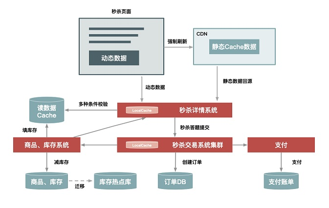
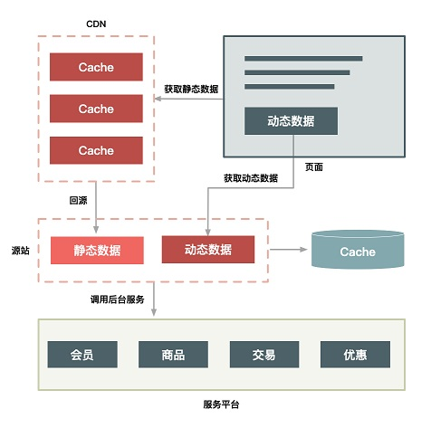
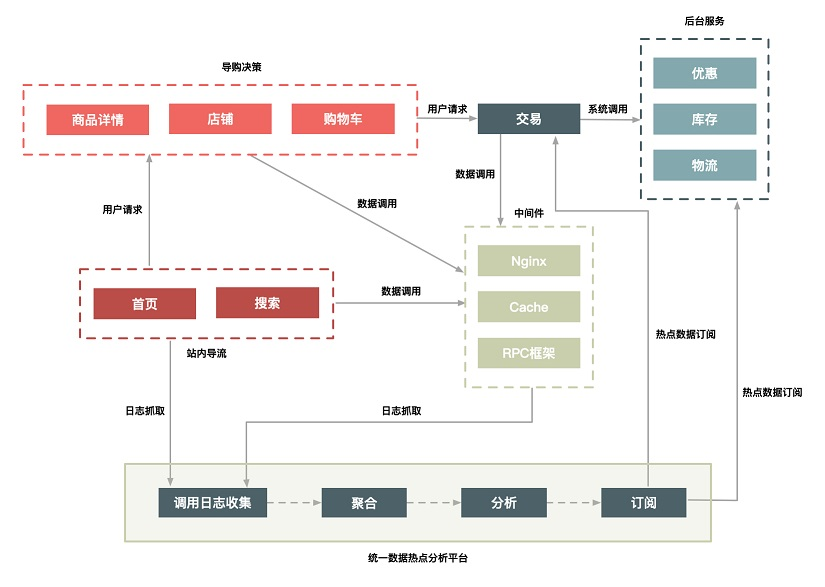

## 秒杀系统设计
秒杀其实主要解决两个问题，一个是并发读，一个是并发写
1. 数据要尽量少  
2. 请求数要尽量少  
合并 CSS 和 JavaScript 文件，把多个 JavaScript 文件，把多个 JavaScript 文件，在 URL 中用逗号隔开
3. 路径要尽量短  
要缩短访问路径有一种办法，就是多个相互强依赖的应用合并部署在一起，把远程过程调用（RPC）变成 JVM 内部之间的方法调用
4. 依赖要尽量少  
减少弱依赖应用（比如去掉优惠券）
5. 不要有单点


### 一、高性能
#### 1. 动静分离方案
CDN


#### 2. 热点的发现与隔离
##### 静态热点数据
卖家通过报名参加的方式提前把热点商品筛选出来，运营平台给商品打标，后台提前预热
##### 动态热点数据
收集链路中各环节的热点数据分析可能会被访问的数据，比如点击商品页时，通过异步系统提前预热详情页的数据


##### 隔离
1. 业务隔离：卖家报名提前预热数据
2. 系统隔离：部署不同的集群
3. 数据隔离：使用不同的缓存或数据库

#### 3. 请求的削峰与分层过滤
##### 削峰
1. 答题、验证码
2. 分层过滤，比如在代理层直接过滤请求，各系统内限流处理
3. 数据库强一致校验，避免扣减到负数

使用消息队列的话获取返回结果比较麻烦，只能轮询（请求数多）或长连接（连接数多）。

#### 4. 服务端的极致优化
1. 请求压缩  
HTTP 请求时做 Gzip 压缩。
2. 减少编码  
不管是磁盘I/O还是网络I/O都要将字符转成字节，每个字符编码都要查表（查表很耗资源）。例如，网页输出是可以直接进行流输出的，getOutputStream() 函数写数据，提前将静态数据转换成字节。
3. 减少序列化  
序列化大部分是在 RPC 中发生，秒杀系统可以将强依赖应用部署到同一个Tomcat容器中（且不能走本机socket）或者直接写在同一个应用里。
4. rest  
使用json，不使用模板引擎。
5. 并发读优化(解决缓存单点问题)  
在秒杀系统内也缓存数据，比如商品标题、描述等静态数据直接存在JVM内，库存数据设置失效时间定期拉取（读可以读到脏数据，下单时数据库强一致性）或者监听数据库变更主动推送变更数据。

### 二、一致性
实际购买过程一般为两步：下单和付款。  
##### 减库存方式
1. 下单接库存  
一定不会超卖，但用户不一定会付款（可能会被恶意下单）
2. 付款减库存  
有可能会出现付不了款，可能已经被其他人买走了（体验较差）
3. 预扣库存  
库存保留一定时间，超时自动释放。在买家付款前，系统会校验该订单的库存是否还有保留：如果没有保留，则再次尝试预扣；如果库存不足（也就是预扣失败）则不允许继续付款；如果预扣成功，则完成付款并实际地减去库存。
##### 如何减库存
**保证减后库存不能为负数**
1. 在应用程序中用事务判断，负数就回滚
2. 直接设置数据库的字段数据为无符号整数
3. CASE WHEN 判断语句
```sql
UPDATE item SET inventory = CASE WHEN inventory >= xxx THEN inventory-xxx ELSE inventory END;
```
**使用缓存**  
如果秒杀商品的减库存逻辑非常单一可以使用缓存，如果有比较复杂的减库存逻辑，或者需要使用事务，还是必须在数据库中完成减库存。

**数据库并发锁问题**  
1. 应用层排队
单应用排队，mq不能拿到返回消息。
2. 数据库排队（一般公司搞不了）
数据库全局排队，阿里数据库团队开发了针对这种 MySQL 的 InnoDB 层上的补丁程序（patch），可以在数据库层上对单行记录做到并发排队。
虽然锁竞争和排队效果相同，但Innodb死锁检测，以及Server层和Innodb层切换比较消耗性能。

### 三、高可用
#### PlanB兜底
1. 降级  
把资源留给核心应用，比如运营平台搞个开关查询交易记录分页本来20条，现在只查询5条。
2. 限流  
客户端限流：使用线程池限制请求发出，但不能控制整体流量  
服务端限流：超过请求数（比如压测1w QPS，生产设置8000）直接拒绝请求，但拒绝也会消耗服务器资源（比如握手）  
3. 拒绝服务  
比如Nginx设置过载保护，超过某个值直接拒绝HTTP请求。比如系统负载超过90%直接拒绝服务。