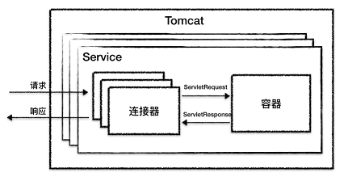
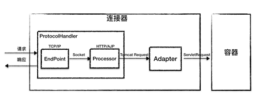
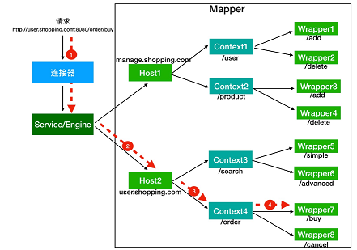

#### 1.Tomcat总体架构
  > 1.处理Socket连接，负责网络字节流与Request和Response对象的转化。Connector
    2.加载和管理Servlet，以及具体处理Request请求。Container
    
因此tomcat设计两个核心组件 `连接器Connector` 和
`容器Container`负责对外交流和内部处理。 



1. 连接器Connector
   对Servlet屏蔽了协议及I/O模型在容器中获得的始终是ServletRequest



    EndPoint 通信端点 具体的Socket由组件Acceptor连接请求，SocketProcessor处理请求
    Processor 定义请求的处理方式ProtocolHandler将socket字节流解析成tomcat request/response
    Adapter 使用service方法 CoyoteAdapter适配模式传入的request解析成ServletRequest
    
2. 容器Container 解析URL根据链找到Servlet Engine -- Host -- Context
   --Servlet



    1.根据协议和端口号选定Service和Engine, 
    2.然后域名选定Host,
    3.之后根基URL找到Context组件。ServletContext代表应用的web应用ApplicationContext而这是tomcat的StandardContext
    4.最后根据URL找到Wrapper(Servlet)

其中使用责任链模式串联起来。Valve代表一个处理点其中包含next属性，然后pipeline作为两边添加Valve

```java 
// Calling the container
      connector.getService().getContainer().getPipeline().getFirst().invoke(request,
response);
```

Tomcat多host配置
 ```xml 
 <server port=“8005” shutdown=“SHUTDOWN”>
    <service name=“Catalina”>
        <engine defaulthost=“localhost” name=“Catalina”>
            <host appbase=“webapps” autodeploy=“true” name=“localhost” unpackwars=“true”></host>
            <host appbase=“webapps1” autodeploy=“true” name=“www.domain1.com” unpackwars=“true”></host>
            <host appbase=“webapps2” autodeploy=“true” name=“www.domain2.com” unpackwars=“true”></host>
            <host appbase=“webapps3” autodeploy=“true” name=“www.domain3.com” unpackwars=“true”></host>
        </engine>
    </service>
</server>
 ```


#### tomcat类加载机制